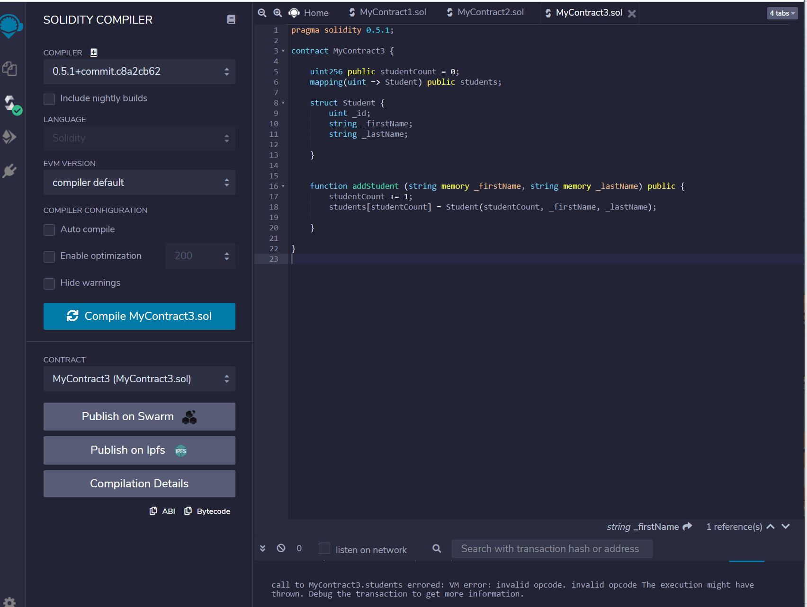
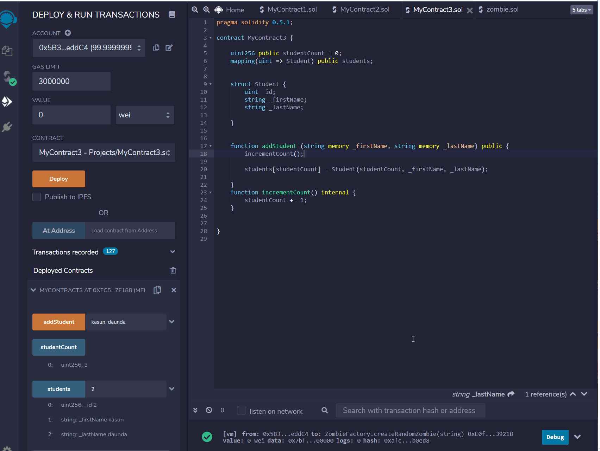
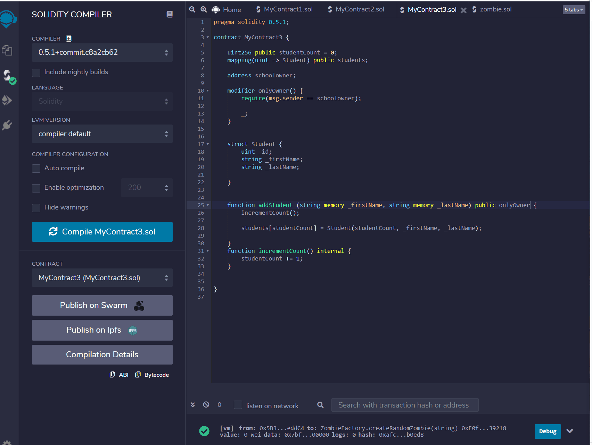

# SmartContractsStructures 03
----

### My third Contract
In this part we are trying to build struct and mapping

----
### Struct!

But using this you cant add students, so we have to make fuction to add more student. 

but the problem is you can add same student twise and it still counting as student count. You can see the problem bellow. 

This is our part 3 final step, but we cant find student by name because student is counting by uint256.

Aslo, if you want to see student count in private, you can use "internal" and below is the example.

-------

#### Above smart contract, anyone can add a student to school, but we can change that only the school owner can add students, All you have to do add only owner modifier to the contract. After you add the only owner, then you have to create a modifier for that.

##### msg.sender is the function we use to say that is the owner.

We can check that it is working. We will see it as below.

you can see that is not working, because we havent set the owner yet.

