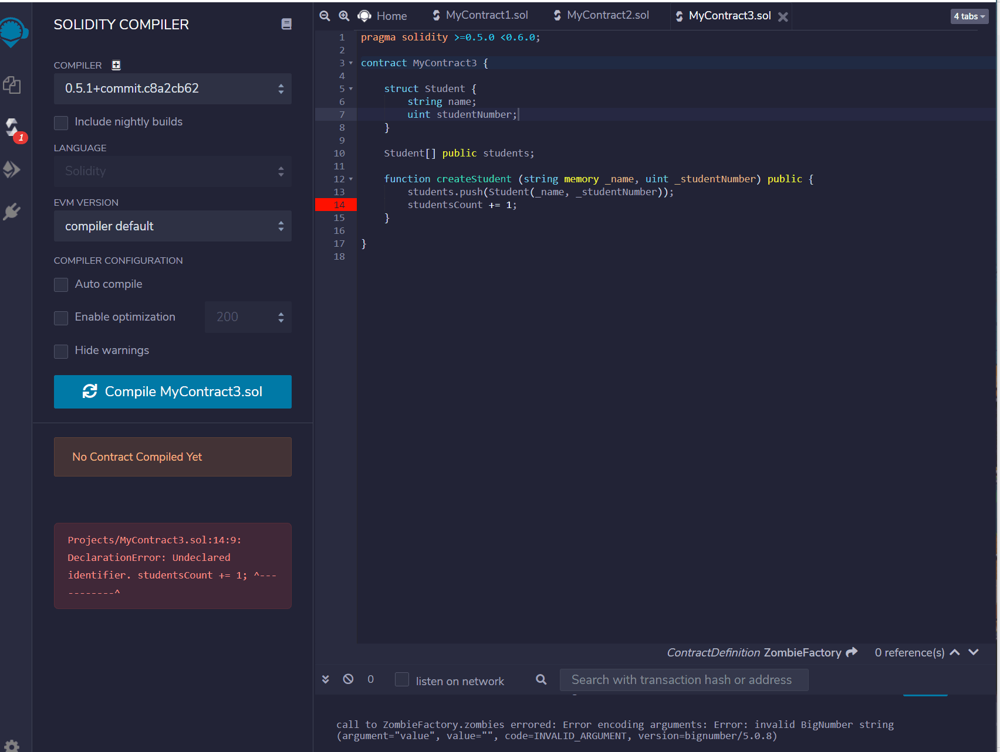
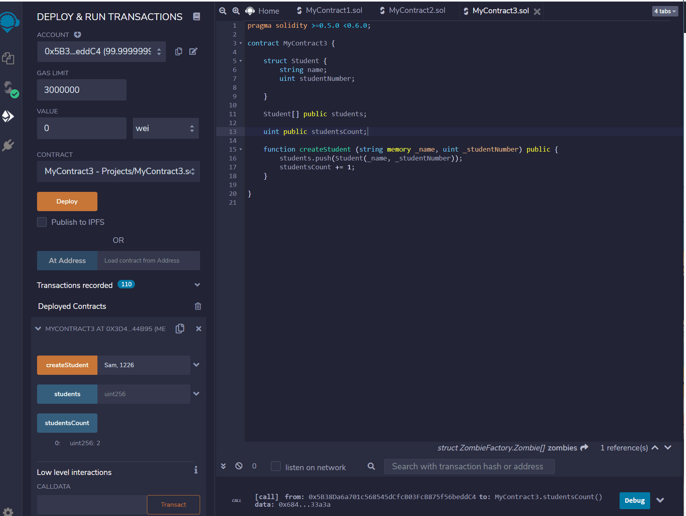

# SmartContractsStructures 03
----

### My third Contract
In this part we are trying to build struct and mapping

----
### Struct!

But using this you cant add students, so we have to make fuction to add more student. 

but the problem is you can add same student twise and it still counting as student count. You can see the problem bellow. 

